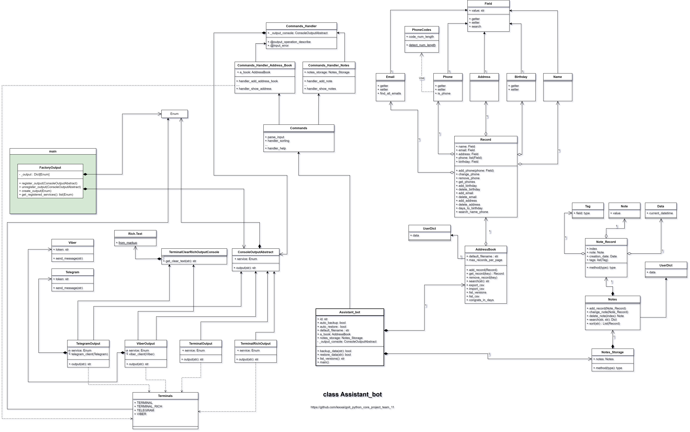
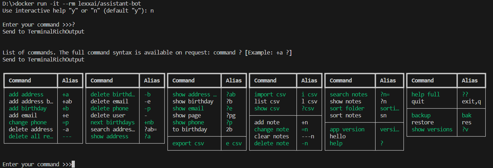

# "Персональний помічник" – Assistant bot.

Персональний помічник допоможе Вам зберігати список Ваших контактів (телефон, email, дату народження, адресу),
робити нотатки та сортувати файли у вказаній директорії. Під час додавання або редагування інформації буде перевірятись правильного вводу телефонного номеру, email та дати народження.

За окремим запитом Помічник вміє виводити список контактів у котрих день народження приходиться протягом вказаної Вами кількості днів.

При створенні нотаток можливо додавання ключових слів, за якими можна проводити сортування та пошук. Сортування файлів у теці проводиться за типами файлів: аудіо-, відео-, документи, зображення, архіви, інше. Повний список команд виводиться після вводу "?".

Синтаксис кожної команди можливо переглянути задавши "?" через пробіл після команди.

- [Інструкція з встановлення програми](https://github.com/lexxai/goit_python_core_project_team_11/wiki/%D0%92%D1%81%D1%82%D0%B0%D0%BD%D0%BE%D0%B2%D0%BB%D0%B5%D0%BD%D0%BD%D1%8F-%D0%BF%D1%80%D0%BE%D0%B3%D1%80%D0%B0%D0%BC%D0%B8)

- [Інструкція користувача](https://github.com/lexxai/goit_python_core_project_team_11/wiki/%D0%86%D0%BD%D1%81%D1%82%D1%80%D1%83%D0%BA%D1%86%D1%96%D1%8F-%D0%BA%D0%BE%D1%80%D0%B8%D1%81%D1%82%D1%83%D0%B2%D0%B0%D1%87%D0%B0)

- [Підтримка користувачів](https://github.com/lexxai/goit_python_core_project_team_11/issues)


- YouTube video:

  - Презентація проєкту: https://youtu.be/ZYg62JWlqEw
  - Встановлленя додатку в середовищі Linux та приклад роботи додатку для презентації (v.0.6.0): https://youtu.be/oPinojZh5rg

- [README розробнику ](https://github.com/lexxai/goit_python_core_project_team_11/wiki/README-%D1%80%D0%BE%D0%B7%D1%80%D0%BE%D0%B1%D0%BD%D0%B8%D0%BA%D1%83)

# Python WEB 15 - Home Work 01

## UML Diagram



## ABS Class, Fabrica pattern

```
usage: assistant_bot [-h] [-u USERNAME] [-sort PATH] [-V] [-dar] [-dab] [--output_console {1,2,3,4}]

Assistant bot of GoIT project team 11

options:
  -h, --help            show this help message and exit
  -u USERNAME, --username USERNAME
                        user name of the Assistant bot
  -sort PATH, --sorting PATH
                        run sorting commands for selected folder. Use path to folder as argument
  -V, --version         show version
  -dar, --disable_auto_restore
                        disable auto_restore
  -dab, --disable_auto_backup
                        disable auto_backup
  --output_console {1,2,3,4}
                        Output console (1: TERMINAL, 2: TERMINAL_RICH, 3: TELEGRAM, 4: VIBER), default: 2
```

`assistant_bot --output_console 1`

```
Enter your command >>>?
Send to TerminalOutput:
The full command syntax is available on request: command ? [Example: +a ?]
List of commands:
add address ('+a'), add address book ('+ab'), add birthday ('+b'), add email ('+e'), add note ('+n'), app version ('version'), backup ('bak'), change note ('=n'), change phone ('=p'), clear notes ('---n'), delete address ('-a'), delete all records ('---'), delete birthday ('-b'), delete email ('-e'), delete note ('-n'), delete phone ('-p'), delete user ('-'), export csv ('e csv'), hello, help ('?'), help full ('??'), import csv ('i csv'), list csv ('l csv'), next birthdays ('+nb'), quit ('exit','q'), restore ('res'), search address book ('?ab='), search notes ('?n='), show address ('?a'), show address book ('?ab'), show birthday ('?b'), show csv ('?csv'), show email ('?e'), show notes ('?n'), show page ('?pg'), show phone ('?p'), show versions ('?v'), sort folder ('sorting'), sort notes ('sn'), to birthday ('2b')

```

`assistant_bot --output_console 2`

```
Enter your command >>>?
Send to TerminalRichOutput


List of commands. The full command syntax is available on request: command ? [Example: +a ?]
Send to TerminalRichOutput

┏━━━━━━━━━━━━━━┳━━━━━━━┓┏━━━━━━━━━━━━━━┳━━━━━━━┓┏━━━━━━━━━━━━━━┳━━━━━━━┓┏━━━━━━━━━━━━━┳━━━━━━━┓┏━━━━━━━━━━━━━━┳━━━━━━━┓┏━━━━━━━━━━━━━━┳━━━━━━━┓
┃ Command      ┃ Alias ┃┃ Command      ┃ Alias ┃┃ Command      ┃ Alias ┃┃ Command     ┃ Alias ┃┃ Command      ┃ Alias ┃┃ Command      ┃ Alias ┃
┡━━━━━━━━━━━━━━╇━━━━━━━┩┡━━━━━━━━━━━━━━╇━━━━━━━┩┡━━━━━━━━━━━━━━╇━━━━━━━┩┡━━━━━━━━━━━━━╇━━━━━━━┩┡━━━━━━━━━━━━━━╇━━━━━━━┩┡━━━━━━━━━━━━━━╇━━━━━━━┩
│ add address  │ +a    ││ delete birt… │ -b    ││ show addres… │ ?ab   ││ import csv  │ i csv ││ search notes │ ?n=   ││ help full    │ ??    │
│ add address… │ +ab   ││ delete email │ -e    ││ show birthd… │ ?b    ││ list csv    │ l csv ││ show notes   │ ?n    ││ quit         │ exit… │
│ add birthday │ +b    ││ delete phone │ -p    ││ show email   │ ?e    ││ show csv    │ ?csv  ││ sort folder  │ sort… │├──────────────┼───────┤
│ add email    │ +e    ││ delete user  │ -     ││ show page    │ ?pg   │├─────────────┼───────┤│ sort notes   │ sn    ││ backup       │ bak   │
│ change phone │ =p    ││ next birthd… │ +nb   ││ show phone   │ ?p    ││ add note    │ +n    │├──────────────┼───────┤│ restore      │ res   │
│ delete addr… │ -a    ││ search addr… │ ?ab=  ││ to birthday  │ 2b    ││ change note │ =n    ││ app version  │ vers… ││ show versio… │ ?v    │
│ delete all … │ ---   ││ show address │ ?a    │├──────────────┼───────┤│ clear notes │ ---n  ││ hello        │       │└──────────────┴───────┘
└──────────────┴───────┘└──────────────┴───────┘│ export csv   │ e csv ││ delete note │ -n    ││ help         │ ?     │
                                                └──────────────┴───────┘└─────────────┴───────┘└──────────────┴───────┘

```

`assistant_bot --output_console 3`

```Enter your command >>>?
Send
The full command syntax is available on request: command ? [Example: +a ?]
List of commands:
add address ('+a'), add address book ('+ab'), add birthday ('+b'), add email ('+e'), add note ('+n'), app version ('version'), backup ('bak'), change note ('=n'), change phone ('=p'), clear notes ('---n'), delete address ('-a'), delete all records ('---'), delete birthday ('-b'), delete email ('-e'), delete note ('-n'), delete phone ('-p'), delete user ('-'), export csv ('e csv'), hello, help ('?'), help full ('??'), import csv ('i csv'), list csv ('l csv'), next birthdays ('+nb'), quit ('exit','q'), restore ('res'), search address book ('?ab='), search notes ('?n='), show address ('?a'), show address book ('?ab'), show birthday ('?b'), show csv ('?csv'), show email ('?e'), show notes ('?n'), show page ('?pg'), show phone ('?p'), show versions ('?v'), sort folder ('sorting'), sort notes ('sn'), to birthday ('2b') to Telegram
```

`assistant_bot --output_console 4`

```Send
The full command syntax is available on request: command ? [Example: +a ?]
List of commands:
add address ('+a'), add address book ('+ab'), add birthday ('+b'), add email ('+e'), add note ('+n'), app version ('version'), backup ('bak'), change note ('=n'), change phone ('=p'), clear notes ('---n'), delete address ('-a'), delete all records ('---'), delete birthday ('-b'), delete email ('-e'), delete note ('-n'), delete phone ('-p'), delete user ('-'), export csv ('e csv'), hello, help ('?'), help full ('??'), import csv ('i csv'), list csv ('l csv'), next birthdays ('+nb'), quit ('exit','q'), restore ('res'), search address book ('?ab='), search notes ('?n='), show address ('?a'), show address book ('?ab'), show birthday ('?b'), show csv ('?csv'), show email ('?e'), show notes ('?n'), show page ('?pg'), show phone ('?p'), show versions ('?v'), sort folder ('sorting'), sort notes ('sn'), to birthday ('2b') to Viber
```

# Python WEB 15 - Home Work 02

## pipenv

```
pip insatall pipenv
# pipenv import requirements.txt
pipenv install
# pipenv add dev package
pipenv install pytest --dev
```

pipfile

```
[[source]]
url = "https://pypi.org/simple"
verify_ssl = true
name = "pypi"

[packages]
importlib-metadata = ">=1.0"
prompt-toolkit = ">=3.0.0"
rich = ">=13.5.0"

[dev-packages]
pytest = "\*"

[requires]
python_version = "3.11"

```

```
pipenv update
pipenv run pip list

Package            Version
------------------ -------
importlib-metadata 6.8.0
markdown-it-py     3.0.0
mdurl              0.1.2
pip                23.2.1
prompt-toolkit     3.0.39
Pygments           2.16.1
rich               13.5.2
setuptools         68.0.0
wcwidth            0.2.6
wheel              0.41.1
zipp               3.16.2
```

## poetry

```
pip install poetry
poetry init
```

pyproject.toml

```
[tool.poetry]
name = "assistant-bot"
version = "0.8.0"
description = "assistant_bot_test"
authors = ["team11"]
license = "MIT"
readme = "README.md"

[tool.poetry.dependencies]
python = "^3.11"
prompt-toolkit = "^3.0.39"
rich = "^13.5.2"

[tool.poetry.group.dev.dependencies]
pytest = "^7.4.0"

[build-system]
requires = ["poetry-core"]
build-backend = "poetry.core.masonry.api"
```

```
poetry run pip list

Package        Version
-------------- -------
colorama       0.4.6
iniconfig      2.0.0
markdown-it-py 3.0.0
mdurl          0.1.2
packaging      23.1
pip            23.2.1
pluggy         1.2.0
prompt-toolkit 3.0.39
Pygments       2.16.1
pytest         7.4.0
rich           13.5.2
setuptools     68.0.0
wcwidth        0.2.6
wheel          0.41.1
```

## docker

Dockerfile

```
FROM python:3.11-slim

ENV APP_HOME /app

WORKDIR $APP_HOME

COPY . .

ENV VIRTUAL_ENV=/app/venv
RUN python -m venv $VIRTUAL_ENV
ENV PATH="$VIRTUAL_ENV/bin:$PATH"

RUN pip install --upgrade pip
RUN pip install -r requirements.txt
RUN pip install .
RUN mkdir $APP_HOME/user_data
RUN cd $APP_HOME/user_data

WORKDIR $APP_HOME/user_data

ENTRYPOINT [ "assistant_bot" ]
```

.dockerignore

```
.*/
dist/
scripts/
*/__pycache__/
```

```
docker -v
Docker version 24.0.2, build cb74dfc
```

### building image lexxai/assistant-bot

1. Відновимо файл 'pyproject' з версії для 'poetry' на версію для 'setuptools'

```
cp pyproject-setuptools.toml pyproject.toml
```

2. Docker tasks:

```

2. Docker tasks:
docker build . -t lexxai/assistant-bot
 => [internal] load build definition from Dockerfile                                                                                0.3s
 => => transferring dockerfile: 1.24kB                                                                                              0.0s
 => [internal] load .dockerignore                                                                                                   0.4s
 => => transferring context: 80B                                                                                                    0.0s
 => [internal] load metadata for docker.io/library/python:3.11-slim                                                                 4.1s
 => [auth] library/python:pull token for registry-1.docker.io                                                                       0.0s
 => [ 1/10] FROM docker.io/library/python:3.11-slim@sha256:17d62d681d9ecef20aae6c6605e9cf83b0ba3dc247013e2f43e1b5a045ad4901         0.0s
 => [internal] load build context                                                                                                   0.5s
 => => transferring context: 30.53kB                                                                                                0.2s
 => CACHED [ 2/10] WORKDIR /app                                                                                                     0.0s
 => [ 3/10] COPY . .                                                                                                                2.2s
 => [ 4/10] RUN python -m venv /app/venv                                                                                           12.0s
 => [ 5/10] RUN pip install --upgrade pip                                                                                          11.0s
 => [ 6/10] RUN pip install -r requirements.txt                                                                                    13.8s
 => [ 7/10] RUN pip install .                                                                                                      12.2s
 => [ 8/10] RUN mkdir /app/user_data                                                                                                2.4s
 => [ 9/10] RUN cd /app/user_data                                                                                                   1.9s
 => [10/10] WORKDIR /app/user_data                                                                                                  1.3s
 => exporting to image                                                                                                              3.5s
 => => exporting layers                                                                                                             3.3s
 => => writing image sha256:c0f0f30b200159521eb4419342f08f29ed3c9d6bb15d71e4cbe05adba62c20e9                                        0.1s
 => => naming to docker.io/lexxai/assistant-bot                                                                                     0.1s
```

### docker images list

```

docker images
REPOSITORY TAG IMAGE ID CREATED SIZE
lexxai/assistant-bot latest c0f0f30b2001 23 minutes ago 220MB

```

### docker run

docker run -it --rm lexxai/assistant-bot


### docker run with save user data on volume

docker run -it --rm -v user_data:/app/user_data --name assistant-bot_volume lexxai/assistant-bot

### docker run bash with override entrypoint

docker run -it --entrypoint /bin/bash lexxai/assistant-bot

```

root@1a35d3bb4776:/app#
root@1a35d3bb4776:/app# apt update
root@1a35d3bb4776:/app# apt install tree
root@1a35d3bb4776:/app# tree
.
├── Dockerfile
├── LICENSE
├── ListOfCommand.txt
├── Pipfile
├── Pipfile.lock
├── README.md
├── assistant_bot
│ ├── **init**.py
│ ├── class_address_book.py
│ ├── class_assistant_bot.py
│ ├── class_command_completer.py
│ ├── class_commands.py
│ ├── class_commands_handler.py
│ ├── class_commands_handler_a_book.py
│ ├── class_commands_handler_notes.py
│ ├── class_console_output.py
│ ├── class_fields.py
│ ├── class_notes.py
│ ├── class_notes_ext.py
│ ├── class_record.py
│ ├── main.py
│ ├── normalize.py
│ └── sorting.py
├── doc
│ ├── assistant_bot_fabric_uml.drawio.png
│ ├── assistant_bot_uml.drawio.png
│ └── docker-run-example-01.png
├── image.png
├── poetry.lock
├── pyproject-setuptools.toml
├── pyproject.toml
├── requirements.txt
├── setup.cfg
└── tests
├── Test_folder
│ ├── Subf1
│ │ ├── Subf3
│ │ │ ├── file.docx
│ │ │ └── file.svg
│ │ ├── Subf4
│ │ │ ├── file.doc
│ │ │ └── file.pdf
│ │ ├── file.jpg
│ │ └── file.txt
│ ├── Subf2
│ │ ├── file.amr
│ │ ├── file.jpeg
│ │ ├── file.mkv
│ │ └── file.png
│ ├── Subf5
│ │ ├── Subf6
│ │ │ ├── Subf7
│ │ │ │ ├── file.mp3
│ │ │ │ ├── file.wav
│ │ │ │ ├── file.xlsx
│ │ │ │ └── list2.targz
│ │ │ ├── file.mov
│ │ │ ├── file.mp4
│ │ │ └── list1.zip
│ │ ├── file.avi
│ │ ├── file.ogg
│ │ ├── file.pptx
│ │ └── list.ar
│ ├── file0.jpg
│ ├── file0.pdf
│ └── файл0.txt
├── Test_folder.rar
├── Test_folder.zip
├── a58057bdc0c5f1b7c3c964a707d14a07ff069a1f_assistant_bot.bin
├── assistant_bot_test.py
├── ex01.py
├── test_a_bot.py
└── tmp
└── appmap
└── unittest
.....

```

### docker run on same containers for save data

```

docker create -it --name assistant-bot lexxai/assistant-bot
docker start -i assistant-bot
```
